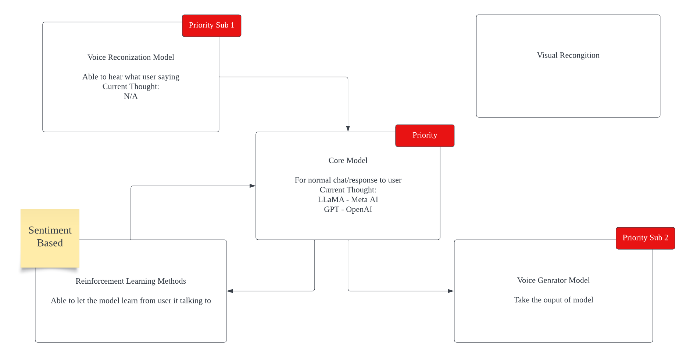

<!-- # Project Yothalia
Should be a noob project on creating a model for human to talk with
<br>
## Basic Idea Scratch


<br/> -->

# Yothalia

## Description of the Project

The project aimed to explore the interaction between humans and chatbots, providing a more immersive experience. Specifically, the goal was to enable Language Model (LLM) to play a character that users could interact with on a AI streamer. And the **Roleplay LLM Chat Model** is part of the entire project

### Roleplay LLM Chat Model

The team explored the methods of prompt engineering, fine-tuning, and a combination of both to make the LLM play as a specific character, such as some famous character. The description below will also mainly focus on this part of project

## Project Milestones and Completion Status

### Technical Challenges

- **Environment Setup on Different Platforms**
  - Deployment on Windows required installing several quantization APIs.
  - Training on Linux posed challenges but was eventually set up.

- **Data Gathering and Engineering**
  - Utilized Hugging Face for easy access to large resources.
  - Data cleaning was necessary, including the removal of emojis.

- **LoRA Construction and Practical Usage**
  - Implemented Low-Rank Adaption (LoRA) to freeze the pretrained model and fine-tune on an inserted adapter layer.
  - Used PEFT (Parameter Efficient Fine-tuning) API for LoRA implementation.
  - Employed Huggingface Trainer with Accelerate for distributed training on HPC clusters.

- **Quantization with bitsandbytes**
  - Utilized bitsandbytes for model loading in both nf4 and nf8.
  - Lower precision reduced memory usage and improved inference time.

### Benchmark and Evaluation

- **Self-Designed Benchmark**
  - Converted the problem into multiple-choice questions for evaluation.
  - Randomly chose four outputs from data, combined with correct instructions, inputs, and outputs.
  - Calculated the accuracy of each model.
  

- **Results and Observations**
  - 128 tokens demonstrated the best performance.
  - Limited improvement after fine-tuning, with notable improvement in Chinese language models.
  - Challenges remained in the model's ability, e.g., incorrect output format.
  - Identified areas for improvement in compute resource usage.

## Repository and Code Structure

For **Roleplay LLM Chat Model**, there are some relative important folders
- **finetune:** A folder that contain all type of finetune code
- **train_sample:** Store all the data we are using including 3 main csv file
- **yothalia/server:** the place to build dataset and run our benchmark Accelerate.

## Example Commands to Execute the Code
We provide two ways to execute our code, local environment and HPC cluster
- **Finetune:** 
  - Local environment:
  ```bash
  ```
  - HPC cluster:
  ```bash
  ```
- **Evaluate:**
  - Place your own access token(we also provide gpt3.5 turbo for comparison) 
  - Local environment: 
  ```bash
  python /yothalia/server/benchmark.py
  ```
  - HPC cluster (you may need to build your own singularity environment):
  ```bash
  cd /yothalia/server
  sbatch benchmark.sh
  ```

## Results and Observations

### Experimental Evaluation

- **Performance Metrics**
  - Numerical evaluation through the self-designed benchmark.
  - Noted improvements and challenges in different aspects of the models.
  

### Profiling
  - Profiling with 1 iteration
  

- **Observations and Conclusion**
  - 128 tokens showed optimal performance.
  - Challenges in model behavior and output format persisted.
  - Opportunities for improvement in compute resource utilization.
  

## References

- Dettmers, T., Lewis, M., Belkada, Y., Zettlemoyer, L., 2022. [LLM.int8(): 8-bit matrix multiplication for transformers at scale](https://arxiv.org/abs/2208.07339).
- Hu, E.J., Shen, Y., Wallis, P., Allen-Zhu, Z., Li, Y., Wang, S., Wang, L., Chen, W., 2022. [LoRA: Low-rank adaptation of large language models](https://openreview.net/forum?id=nZeVKeeFYf9).
- Mangrulkar, S., Gugger, S., Debut, L., Belkada, Y., Paul, S., Bossan, B., 2022. [PEFT: State-of-the-art parameter-efficient fine-tuning methods](https://github.com/huggingface/peft).
- Team, I., 2023. [InternLM: A multilingual language model with progressively enhanced capabilities](https://github.com/InternLM/InternLM).
- Touvron, H., Martin, L., Stone, K., Albert, P., Almahairi, A., Babaei, Y., Bashlykov, N., Batra, S., Bhargava, P., Bhosale, S., et al., 2023. [LLAMA 2: Open foundation and fine-tuned chat models](https://arxiv.org/abs/2307.09288).

## Conclusion

This project explored the fusion of prompt engineering and fine-tuning to enable an LLM to play a specific character, presenting challenges, solutions, and performance evaluations. The results contribute to the ongoing advancements in AI-powered character interactions for immersive user experiences in the field of entertainment.
